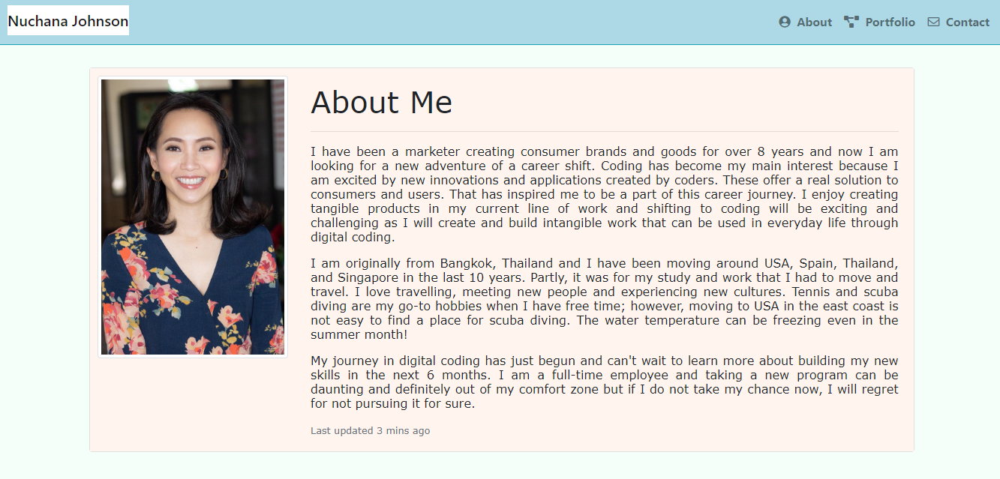

What I updated this time

I feel more comfortable to use CSS and bootstrap and understand better how to customize the bootstrap templates. I also learnt how to use fontawesome to create some special icons which was something I didn't know about when I firstly worked on this assignment 2 months ago.

For About me page, I changed to use card template instead of manipulating col/ grid system and use some padding in CSS to adjust my profile image. On the sticky nav bar, I added fontawesome and its href links across pages. 

For portfolio page, I changed to use the figure component in Bootstrap as I want to display related images and text with figure caption (instead of using image thumbnail). 

For contact, i made no change as I used forms in bootstrap. 

The following image demonstrates my portfolio

